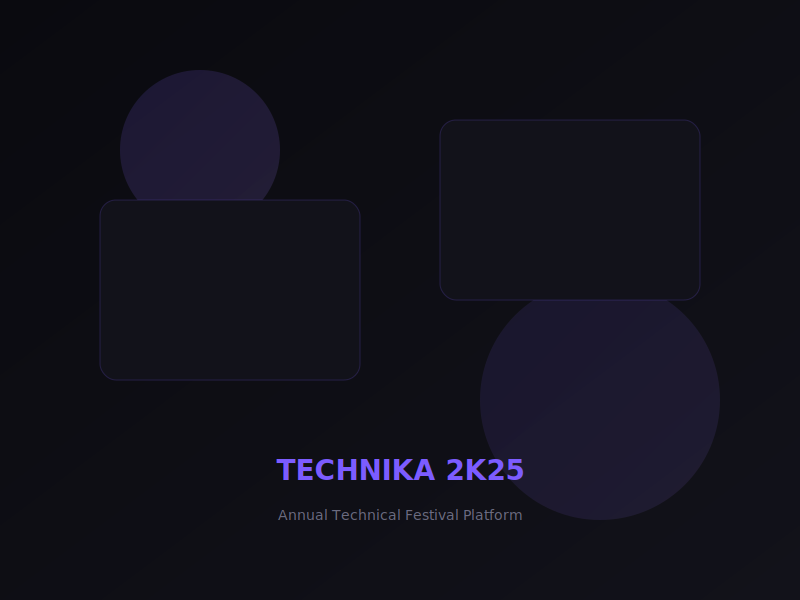

# DevStudio | Premium Digital Engineering Portfolio

A high-performance, animation-rich portfolio website built for a developer-led consulting studio. The project transforms a premium Stitch design system into a fully functional React application featuring GSAP scroll animations, glassmorphism UI components, and a custom dark theme aesthetic.

 *Note: Replace with actual screenshot*

## 🌟 Key Features

- **Premium Aesthetic**: Deep dark theme (`#0A0A0F`) with glassmorphism cards, glowing borders, and gradient accents (`#7C5CFF` to `#A17CFF`).
- **Immersive Animations**: Powered by GSAP and ScrollTrigger:
  - Staggered 3D split-text character reveal on the hero section.
  - Scroll-triggered fade up components (`<AnimatedSection />`).
  - Animated number counters for statistics (`<StatsCounter />`).
  - Continuous floating elements and scroll-linked parallax backgrounds.
- **Fully Responsive**: Mobile-first TailwindCSS implementation that flawlessly scales up to the high-end desktop designs.
- **Component Architecture**: Modular, reusable React components built for scalability.
- **Dynamic Data**: Portfolio projects, developers, and services are separated into data files for easy content management.

## 🚀 Tech Stack

- **Framework**: [React 19](https://react.dev/) + [Vite](https://vitejs.dev/)
- **Routing**: [React Router v7](https://reactrouter.com/)
- **Styling**: [Tailwind CSS v3](https://tailwindcss.com/)
- **Animation**: [GSAP](https://gsap.com/) (GreenSock Animation Platform) + ScrollTrigger
- **Icons & Typography**: Google Material Symbols, Space Grotesk (Headings), Inter (Body)

## 📁 Project Structure

```
src/
├── assets/             # Static assets (images, SVGs)
├── components/         # Reusable UI components
│   ├── AnimatedSection.jsx  # GSAP ScrollTrigger wrapper
│   ├── DeveloperCard.jsx    # Team profile cards
│   ├── Footer.jsx           # Global footer
│   ├── Navbar.jsx           # Glassmorphism sticky nav
│   ├── ProjectCard.jsx      # Portfolio item card
│   ├── SplitText.jsx        # Hero text animation
│   └── StatsCounter.jsx     # Animated number counter
├── data/               # Content data files
│   ├── developers.js        # Team member profiles
│   ├── projects.js          # Portfolio items (Technika, Prakrida)
│   └── services.js          # Services, stats, and testimonials
├── pages/              # Primary route components
│   ├── About.jsx            # Mission, stats, and timeline
│   ├── Contact.jsx          # Form and studio details
│   ├── Developers.jsx       # The Team
│   ├── Home.jsx             # Main landing page
│   └── Work.jsx             # Dedicated portfolio grid
├── App.jsx             # React Router setup & layout wrapper
├── index.css           # Global custom styles (glass, glow, scrollbar)
└── main.jsx            # React root injection
```

## 🎨 Design System

The project implements a bespoke design system defined in the `tailwind.config.js` and `index.css`:

- **Colors**:
  - `background`: `#0A0A0F`
  - `card`: `#12121A`
  - `primary`: `#7C5CFF` (Gradient to `#A17CFF`)
- **Effects**:
  - `.glass-card`: Translucent background with backdrop blur.
  - `.glow-hover`: Custom box-shadow transitions on hover.
  - `.glow-border`: Excluded mask compositing for gradient borders.
  - `.noise-bg` & `.grid-bg`: SVG data URI backgrounds for added texture.

## 💻 Getting Started

### Prerequisites
- Node.js (v18+)
- npm or yarn

### Installation

1. Install dependencies:
   ```bash
   npm install
   ```

2. Start the development server (runs on `http://localhost:5173`):
   ```bash
   npm run dev
   ```

3. Build for production:
   ```bash
   npm run build
   ```

4. Preview production build:
   ```bash
   npm run preview
   ```

## 🤝 Project Content

The portfolio currently showcases:
- **Technika 2k25**: Annual Technical Festival Platform (React, GSAP, Three.js).
- **Technika 2k24**: Legacy Festival Platform (Next.js, Framer Motion).
- **Prakrida 2k25**: Sports Festival Platform (React, Express, PostgreSQL).

Developer Profiles:
- Aayush Arya (Lead Developer & Founder)
- Ikrish (Frontend Engineer & Designer)
- Ashutosh (Backend Engineer)
